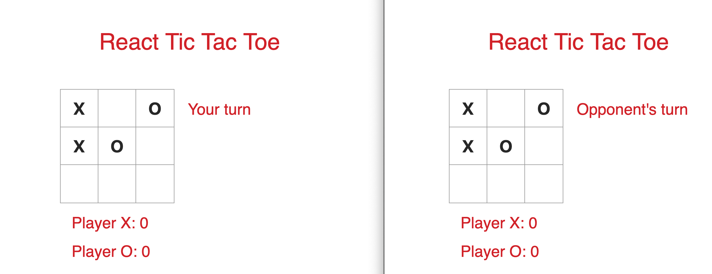
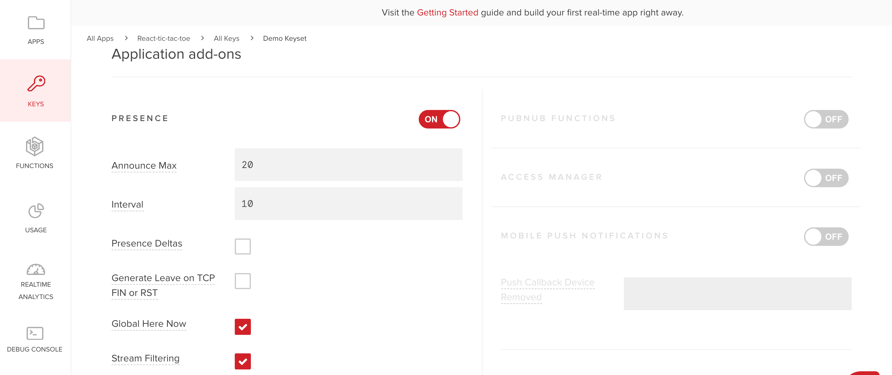

# Realtime Tic Tac Toe Game in React

> [React Tic Tac Toe](https://ocastroa.github.io/react-tictactoe)

Want to develop a multiplayer game without having to worry about building your own realtime infrastructure? In this tutorial, you will learn how to do so by building a tic tac toe game in React. We will use [PubNub's React SDK](https://www.pubnub.com/docs/react-native-javascript/pubnub-javascript-sdk) to connect two players to a game channel. Every move the players makes in the board will be seen by both players in realtime! 

<p align="center">
  
</p>

## Setup
1) Sign up for a free PubNub account to get your Pub/Sub API keys.
 <a href="https://dashboard.pubnub.com/signup?devrel_gh=react-tictactoe">
    
  </a>

2) You need to enable presence to detect the number of players in the channel. This prevents having more than two players in a given channel. Go to your [PubNub Admin Dashboard](https://admin.pubnub.com), click on the Demo Project App, or create a new app for this project, and click on Keyset. Scroll down to Application add-ons and toggle the Presence switch to on. Keep the default values the same.

<p align="center">
  
</p>

3) Clone the repo.
```bash
git clone https://github.com/ocastroa/react-tictactoe.git
```
4) Open the project in your favorite text editor.

5) Go to App.js and replace 'ENTER_YOUR_PUBLISH_KEY_HERE' and 'ENTER_YOUR_SUBSCRIBE_KEY_HERE' with the keys you got from Step 1.

6) Install the dependencies by running the script that's in the root directory. Make sure to make the script executable first.
```bash
#dependencies.sh
chmod +x dependencies.sh # Execute the script
./dependencies.sh # Run the script
```

7) If you ran the above script, the app will open in http://localhost:3000 as soon as the dependencies are installed. You can also run the app (make sure to install dependencies first) by running the command:
  ```bash
    npm start
  ```
8) When the app opens, copy and paste http://localhost:3000 to another window. In one window, create a channel by pressing the 'Create' button and copy the room id. In the other window, press the 'Join' button and paste the room id in the input field. Press enter and the game will start. Place the 'X' piece in the window that you created the room and watch as the other window is updated in realtime. Play around with both windows until there is a winner or a tie game!


## Build Your Own Realtime Tic Tac Toe Game in React

To learn more about this project or if you want to build this project from scratch, check out the tutorial.

  <a href="https://www.pubnub.com/blog/build-a-multiplayer-tic-tac-toe-game-in-react/?devrel_gh=react-tictactoe">
    
  </a>
